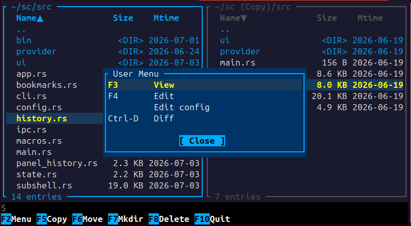
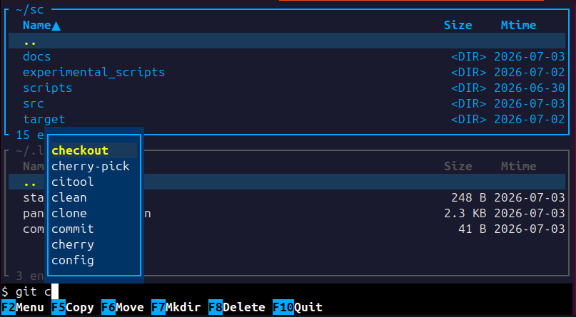

# Sunset Commander (sc)

A two-panel visual shell for Linux terminals, in the spirit of Midnight Commander.

## Features

- Mouse support.
- Two panels for browsing directories side by side; one panel is active at a time.
- Vertical and horizontal panel layout.
- Multiple file selection (tagging), including pattern-based select/unselect groups.
- Quick file operations: copy or move between the two panels, delete etc.
- Sort panel contents by different criteria.
- Directory bookmarks and per-panel navigation history.
- Quicksearch and filtering within a panel.
- A command line below the panels, with popups for command history search and bash-style completion,
  and quick ways to inject names and paths.
- A configurable user menu of shell commands, with macro substitution for file/path
  arguments.
- A configurable button bar.
- Two ways to run shell commands: a stateless mode (one-off commands with a scrollable
  output overlay) and a subshell mode (a persistent shell session you can drop into).
- Fully configurable key bindings, color scheme, and startup behavior via a [`JSON config file`](docs/Configuration.md).
- Find other convenient features not mentioned here in the [`cheat sheet`](docs/CheatSheet.md).

## Screenshots

| User menu | Command-line autocompletion |
|---|---|
|  |  |

## Installation

Requires a recent Rust toolchain ([rustup.rs](https://rustup.rs)).

Build and run from source:

```sh
cargo build --release
./target/release/sc
```

Or build a Debian package with [`cargo-deb`](https://github.com/kornelski/cargo-deb):

```sh
cargo install cargo-deb
SC_INSTALL_PREFIX=/usr cargo deb
sudo dpkg -i target/debian/sc_*.deb
```

Or build an RPM package with [`cargo-generate-rpm`](https://github.com/cat-in-136/cargo-generate-rpm)
(unlike `cargo-deb`, it doesn't build for you, so run `cargo build` first):

```sh
cargo install cargo-generate-rpm
SC_INSTALL_PREFIX=/usr cargo build --release
cargo generate-rpm
sudo rpm -ivh target/generate-rpm/sc-*.rpm
```

To produce a statically-linked binary (useful for installing on distros with an
older or different glibc than your build machine), target musl and pass
`--target` to whichever packager you use (`cargo-deb` also needs `--no-build`,
otherwise it triggers its own dynamically-linked build):

```sh
rustup target add x86_64-unknown-linux-musl
SC_INSTALL_PREFIX=/usr cargo build --release --target x86_64-unknown-linux-musl
cargo deb --variant musl --target x86_64-unknown-linux-musl --no-build
cargo generate-rpm --target x86_64-unknown-linux-musl
```

`--variant musl` picks up the `[package.metadata.deb.variants.musl]` override in
`Cargo.toml`, which skips shared-library dependency detection — a static binary
has none, so the default `$auto` otherwise just prints a harmless warning.

## Usage

```sh
sc [OPTIONS] [DIR1] [DIR2]
```

Run `sc --help` for the full list of options, or see
[`docs/CommandLineArgs.md`](docs/CommandLineArgs.md) for the complete reference, including
how `DIR1`/`DIR2` interact with the `--restore-paths` option.

## Configuration

See [`docs/Configuration.md`](docs/Configuration.md)
Default key bindings are listed in [`docs/CheatSheet.md`](docs/CheatSheet.md)

## Combining Panels and the Command Line

The command line and the panels work together: shortcuts let you pull file names and paths,
without typing them by hand.

For example, if you want to create an archive in a directory containing all markdown files in
another directory (`*.md`) except one, you can:

- Navigate to the directory with the markdown files
- Press `+`, type `*.md` and then press `Enter`
- Select the file that you want to exclude and Press `Ins` (or right click on it).
- Change active panel with `Tab`
- Navigate to the directory where you want to create the archive
- Type `tar czf archive.tar.gz -C ` on the command line.
- Press `Ctrl-x Ctrl-p` to append the other panel's directory.
- Add a space.
- Press `Ctrl-x Ctrl-t` to append the tagged files from the other panel.
- Press `Enter`

The same idea works for quick one-off commands on a single file: `Ctrl-Enter` inserts the
selected file's name at the cursor, although you may prefer the auto completion
(`Alt-Tab` or `Ctrl-Space`). See [`docs/CheatSheet.md`](docs/CheatSheet.md) for the complete list
of command-line shortcuts.

## Custom Menu Commands

Add entries to the `"menu"` array in `~/.config/sc/config.json` (see
[`docs/Configuration.md`](docs/Configuration.md) for the full schema). Each entry needs a
`label` and a `command`; `command` can reference the selected file, the tagged files, or
either panel's directory using the macros documented in
[`docs/MacroSubstitution.md`](docs/MacroSubstitution.md). An optional `keys` runs the
command directly without opening the menu, and `add_to_bar: true` also shows it as a button
in the button bar (see [Customizing the Button Bar](#customizing-the-button-bar) below).

If `~/.config/sc/config.json` doesn't exist yet, sc creates one the first time it runs,
already wired up with `View` / `Edit` / `Edit config` entries — so you're extending
a working file, not starting from a blank one.

Menu edits take effect the next time you press F2 — no need to restart sc. Direct `keys`
shortcuts and `add_to_bar` buttons pick up the change too, but only once F2 has been
pressed at least once after saving (they aren't reloaded independently).

Two examples:

```jsonc
{
  "menu": [
    // Archive the tagged files (or the selected one) straight into the other panel.
    { "label": "Archive to other panel", "command": "tar czf %D/archive.tar.gz %s" },

    // Similar to the manual example in "Combining panels and the command line"
    { "label": "Archive from other panel", "command": "tar czf \"`basename %D`\".tar.gz -C %D %S" },

    // Count lines in the tagged files, or the selected file if none are tagged.
    { "label": "Word count", "command": "wc -l %s", "keys": "F9" }
  ]
}
```

`%D` is the other panel's directory and `%s` is the tagged files (or the selected file, if
none are tagged) — see `docs/MacroSubstitution.md` for the rest.
More complex command should delegate to a script file and should check if nothing (or `..`) is selected.

## Customizing the Button Bar

The button bar always shows the built-in function-key actions (Copy, Move, Delete, ...). To
add your own commands to it, give a menu entry (see above) `"add_to_bar": true`:

```jsonc
{
  "menu": [
    { "label": "Grep", "command": "grep -rn %s . | less", "keys": "F11", "add_to_bar": true },
    { "label": "Disk usage", "command": "du -sh %d", "add_to_bar": true }
  ]
}
```

Entries with a function-key `keys` binding take that key's slot in the bar, sorted by key
number; entries without one are appended after, in the order they appear in the config file.
Bar colors come from the `button_bar_*` keys in the color scheme (see
[`docs/Configuration.md`](docs/Configuration.md)).

## More Complex Scripting

sc can be driven from outside its own UI. This feature is particularly useful in combination
with user-menu commands. The set of actions that can be triggered will grow, but you can
already inject strings in the command line, select or filter files in the panel, and more.
See [`docs/IpcActions.md`](docs/IpcActions.md) for the full list of actions and examples.

## License

MIT — see [`LICENSE`](LICENSE).
